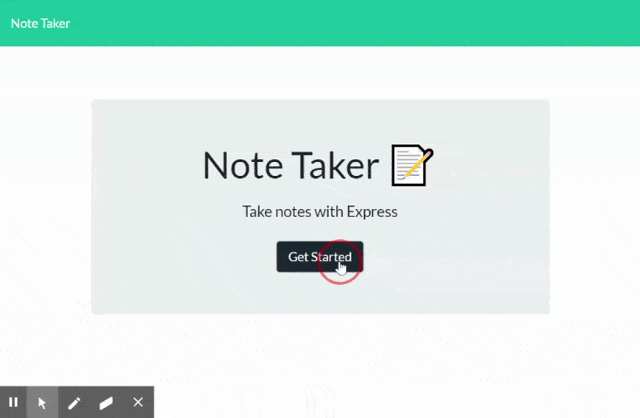

# Note Taker
[](https://lbesson.mit-license.org/)

## Description



Note Taker is a webpage housing an restful API written in express that services a JSON database.  It allows the user to create, edit, delete, and store notes.


## Table of Contents

* [Usage](#usage)
* [License](#license)
* [Contributing](#contributing)
* [Questions/Contact](#questions/contact)


## Usage

The site can either be downloaded and ran locally via ```NPM start```, or you can access the Heroku deployed version at the following URL.

https://calm-citadel-50486.herokuapp.com/ 


## License

[](https://lbesson.mit-license.org/)

This project is covered under the MIT.  Click the badge above to learn more.


## Contributing

To contribute to the project, send me a message on github.


## Questions/Contact

 http://github.com/emelanson

 My email is (my first and last name)@gmail.com


  